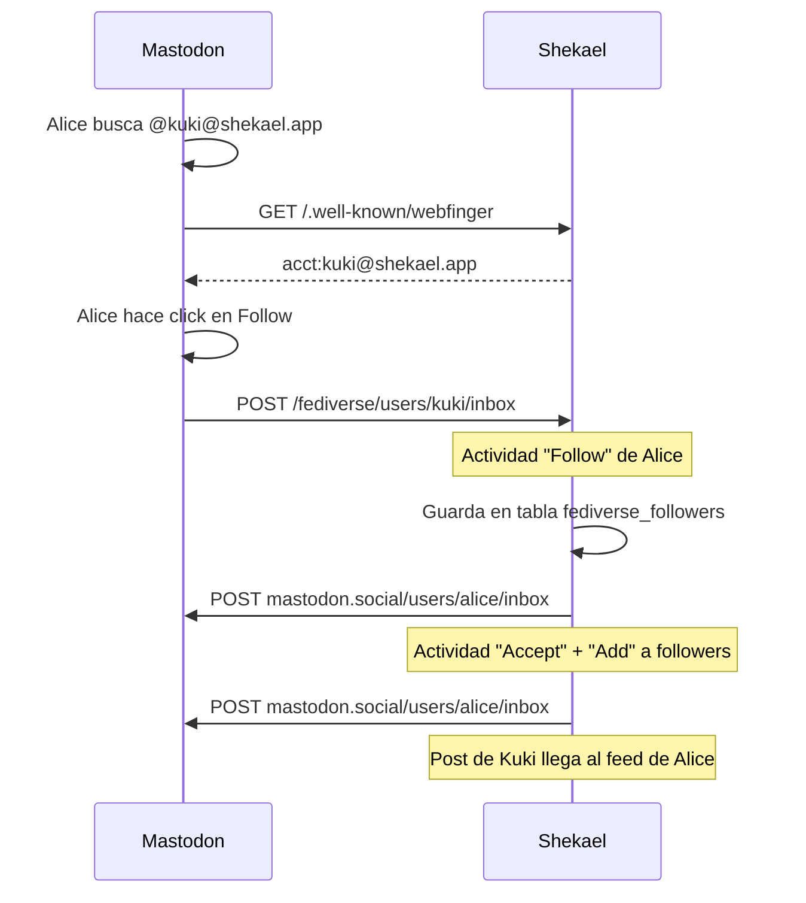

# Plan: Fediverso + Monetización Cross-Platform para Shekael

> Basado en discusión del 22-Jul-2026: Shekael Embed Player, CPM diferencial por país,
> pool 70/20/10 cross-platform, Stellar micropagos.

## Filosofía Central

Shekael no es "otra red social con ActivityPub". Shekael es **la primera red del Fediverso donde usuarios y creadores ganan dinero**. El Fediverso tiene 50M+ usuarios pero NADIE paga. Esa es nuestra ventaja.

El contenido se puede ver desde Mastodon, Pixelfed, PeerTube — pero **la monetización siempre pasa por Shekael** porque Shekael controla el embed player, los anuncios y los pagos.

---

## Fase 1: Lectura del Fediverso (Contenido instantáneo)
*Duración: 1-2 días*

### Objetivo
Que Shekael tenga contenido desde el día 1. El feed ya no está vacío.

### Qué se implementa

**1.1. Servicio ActivityPub — Solo Lectura**
```
shekael-api/src/services/federation.js
├── fetchTimeline('mastodon.social', limit=20)
├── fetchTimeline('pixelfed.social', limit=20)
├── fetchTrending()
├── searchFediverse(query)
└── storeFederatedPost(post) → tabla federated_posts
```

- Fetch de timelines públicas de instancias populares (mastodon.social, pixelfed.social)
- Cache en Supabase (tabla `federated_posts`) para evitar re-fetch
- TTL de 15 min para timelines, 1 hora para trending

**1.2. Tabla en Supabase**
```sql
CREATE TABLE federated_posts (
    id TEXT PRIMARY KEY,           -- URI único en el Fediverso
    instance TEXT,                 -- mastodon.social, pixelfed.social
    author_handle TEXT,            -- @usuario@instancia
    author_name TEXT,
    author_avatar TEXT,
    content TEXT,                  -- HTML del post (convertido a texto plano)
    media_urls TEXT[],             -- URLs de imágenes/videos
    media_type TEXT,               -- image, video, text
    url TEXT,                      -- URL original
    likes_count INT DEFAULT 0,
    shares_count INT DEFAULT 0,
    language TEXT,
    fetched_at TIMESTAMPTZ DEFAULT NOW(),
    expires_at TIMESTAMPTZ         -- Para cache
);
```

**1.3. Feed "Global" en Frontend**

El feed actual (`/feed`) se divide en dos tabs:
- **"En Shekael"** — posts de usuarios de Shekael (lo que ya existe)
- **"Global"** — posts del Fediverso (nuevo)

```jsx
// Feed.jsx — tabs
<TabBar>
    <Tab selected={feedType==='local'}>En Shekael</Tab>
    <Tab selected={feedType==='global'}>Global 🌐</Tab>
</TabBar>

{feedType === 'global' && <FederatedFeed />}
```

**1.4. Intercalado de Anuncios**

Los posts del Fediverso también tienen anuncios cada ~7 posts. El AdSlot ya existe, solo se reusa.

### Monetización Fase 1
- **Anuncios en feed Global** → mismo modelo: 50% usuario, 50% Shekael
- Usuario gana viendo anuncios al lado de posts del Fediverso
- Los creadores del Fediverso **aún no** reciben pago (son lectores pasivos de su contenido público)

---

## Fase 2: Perfiles ActivityPub (Identidad Federada)
*Duración: 2-3 días*

### Objetivo
Cada usuario de Shekael tiene una identidad en el Fediverso. Otros pueden seguir a `@kuki@shekael.app` desde Mastodon.

### Qué se implementa

**2.1. Actor ActivityPub**

```javascript
// GET /.well-known/webfinger?resource=acct:username@shekael.app
{
    "subject": "acct:kuki@shekael.app",
    "links": [{
        "rel": "self",
        "type": "application/activity+json",
        "href": "https://shekael.app/fediverse/users/kuki"
    }]
}

// GET /fediverse/users/kuki (Actor profile)
{
    "@context": "https://www.w3.org/ns/activitystreams",
    "type": "Person",
    "id": "https://shekael.app/fediverse/users/kuki",
    "preferredUsername": "kuki",
    "name": "Kuki",
    "summary": "<p>Bio de Shekael</p>",
    "icon": { "type": "Image", "url": "https://r2.shekael.app/avatars/kuki.jpg" },
    "inbox": "https://shekael.app/fediverse/users/kuki/inbox",
    "outbox": "https://shekael.app/fediverse/users/kuki/outbox",
    "followers": "https://shekael.app/fediverse/users/kuki/followers",
    "following": "https://shekael.app/fediverse/users/kuki/following",
    "publicKey": { ... }  // Para firma HTTP Signature
}
```

**2.2. Endpoints ActivityPub**
```
POST   /fediverse/users/:username/inbox     ← Recibir actividades (likes, follows, posts)
GET    /fediverse/users/:username/outbox    ← Posts públicos del usuario
GET    /fediverse/users/:username/followers ← Lista de seguidores
GET    /fediverse/users/:username/following ← Lista de seguidos
GET    /.well-known/webfinger               ← Discovery (WebFinger)
GET    /fediverse/nodeinfo                  ← Información del servidor
```

**2.3. WebFinger + HTTP Signatures**

- WebFinger permite a otras instancias encontrar usuarios de Shekael
- HTTP Signatures para autenticar requests entre servidores (estándar ActivityPub)
- Usar `http-message-signatures` o `node-http-signature`

**2.4. Mapeo de Perfiles**

| Shekael | Fediverso |
|---------|-----------|
| `users.id` | `fediverse/actors` URI |
| `users.username` | `preferredUsername` |
| `users.avatar_url` | `icon.url` |
| `users.bio` | `summary` (HTML sanitizado) |
| `users.followers_count` | `followers` collection |

### Consideraciones de Chat

El chat de Shekael (Socket.io, stickers, polls, grupos) **NO** se federará — es imposible mapear la riqueza de features de Shekael al DM de ActivityPub (que es básicamente "posts de acceso restringido"). El chat se mantiene 100% Shekael.

### Monetización Fase 2
- Más visibilidad para Shekael en el Fediverso
- Usuarios de Mastodon encuentran perfiles de Shekael → algunos se registran

---

## Fase 3: Posts Federados (Shekael hacia afuera)
*Duración: 3-4 días*

### Objetivo
Los posts de Shekael aparecen en el feed de seguidores de Mastodon/Pixelfed.

### Qué se implementa

**3.1. Publicación Saliente**

Cuando un usuario publica en Shekael:

```javascript
// En posts.routes.js — después de crear post
async function federatePost(post, user) {
    const activity = {
        "@context": "https://www.w3.org/ns/activitystreams",
        "type": "Create",
        "actor": `https://shekael.app/fediverse/users/${user.username}`,
        "object": {
            "type": user.post.media_type === 'video' ? 'Video' : 'Note',
            "id": `https://shekael.app/fediverse/posts/${post.id}`,
            "content": post.content_html,  // HTML sanitizado
            "url": `https://shekael.app/post/${post.id}`,
            "attributedTo": `https://shekael.app/fediverse/users/${user.username}`,
            "to": ["https://www.w3.org/ns/activitystreams#Public"],
            "mediaType": "text/html"
        }
    };

    // Entregar a todos los followers que están en otras instancias
    for (const follower of user.fediverse_followers) {
        await deliver(follower.inbox_url, activity);
    }
}
```

**3.2. Outbox paginado**

```javascript
GET /fediverse/users/:username/outbox?page=1
{
    "@context": "https://www.w3.org/ns/activitystreams",
    "type": "OrderedCollectionPage",
    "id": "https://shekael.app/fediverse/users/kuki/outbox?page=1",
    "partOf": "https://shekael.app/fediverse/users/kuki/outbox",
    "orderedItems": [
        { "type": "Create", "object": { ... post público ... } }
    ]
}
```

**3.3. Imágenes y Videos**

- Imágenes: servidas desde Cloudflare R2 con cabeceras CORS correctas
- Mastodon descarga y cachea la imagen automáticamente
- **Videos**: Se federan como enlace al Embed Player de Shekael
  - El post en Mastodon muestra: preview thumbnail + link "Ver en Shekael"
  - O embed iframe si la instancia lo soporta (PeerTube sí)

**3.4. Likes y Comentarios Cruzados**

- Cuando alguien desde Mastodon da like a un post de Shekael → llega al inbox
- Shekael procesa el like y actualiza el contador
- El creador ve "A @alice@mastodon.social le gustó tu post"

```
POST /fediverse/users/kuki/inbox
{
    "type": "Like",
    "actor": "https://mastodon.social/users/alice",
    "object": "https://shekael.app/fediverse/posts/123"
}
```

**3.5. Followers Cruzados**



**3.6. Tablas Nuevas en Supabase**

```sql
-- Identidad federada de cada usuario
CREATE TABLE fediverse_actors (
    user_id TEXT PRIMARY KEY REFERENCES users(id),
    actor_url TEXT UNIQUE,           -- https://shekael.app/fediverse/users/username
    private_key TEXT,                -- Clave privada RSA para firmar actividades
    public_key TEXT,                 -- Clave pública (se comparte en perfil Actor)
    is_discoverable BOOL DEFAULT TRUE
);

-- Seguidores de otras instancias
CREATE TABLE fediverse_followers (
    id UUID PRIMARY KEY DEFAULT gen_random_uuid(),
    shekael_user_id TEXT REFERENCES users(id),
    follower_actor_url TEXT,         -- https://mastodon.social/users/alice
    follower_inbox_url TEXT,         -- Para entregar posts
    follower_handle TEXT,            -- @alice@mastodon.social
    accepted BOOL DEFAULT FALSE,
    created_at TIMESTAMPTZ DEFAULT NOW()
);

-- Posts que han sido federados
CREATE TABLE federated_outbox (
    post_id TEXT PRIMARY KEY REFERENCES posts(id),
    activitypub_id TEXT UNIQUE,       -- URI en el Fediverso
    delivered_to INT DEFAULT 0,       -- Contador de entregas
    created_at TIMESTAMPTZ DEFAULT NOW()
);
```

### Monetización Fase 3

Los posts federados que llegan a Mastodon NO tienen anuncios (Mastodon no los sirve). **Pero** cuando alguien hace clic en el enlace y ve el post en Shekael, ahí se muestran anuncios normales.

**Feature adicional:** Si un post de Shekael se vuelve viral en Mastodon, el creador gana más porque más visitas llegan a Shekael.

---

## Fase 4: Embed Player + Monetización Cross-Platform ⭐
*Duración: 3-4 días*

### Objetivo
Videos de Shekael reproducibles desde Mastodon/Pixelfed via iframe, con anuncios controlados por Shekael. El creador gana aunque el viewer esté en Mastodon.

### El Problema que Resuelve

```
HOY:
YouTube embed en Twitter → YouTube muestra anuncios → YouTube paga al creador

MAÑANA:
Shekael embed en Mastodon → Shekael muestra anuncios → Shekael paga al creador

DIFERENCIA:
YouTube paga ~$0.66/1K views al creador mexicano
Shekael paga 70% del CPM diferencial → hasta 3.5x más
```

### Qué se implementa

**4.1. Shekael Embed Player**

```
Ruta: /embed/video/:postId
Render: Player minimalista (sin sidebar, sin comentarios)
```

```html
<!-- Código que otros pueden copiar para embed -->
<iframe 
    src="https://shekael.app/embed/video/abc123"
    width="560" height="315"
    frameborder="0"
    allowfullscreen>
</iframe>
```

El embed player:
- Detecta el referrer (para analytics cross-platform)
- Carga video desde Cloudflare R2
- **Muestra anuncio pre-roll (5-15s)**
- Usa GeoIP para determinar CPM (USA → más, México → menos)
- Tracking: watch time, completion rate, geo, referrer

**4.2. ActivityPub Video Federation**

Los posts con video en Shekael se federan como tipo `Video`:
```json
{
    "type": "Video",
    "url": {
        "type": "Link",
        "href": "https://shekael.app/embed/video/abc123",
        "mediaType": "text/html",
        "name": "Ver en Shekael"
    },
    "attachment": [{
        "type": "Link",
        "href": "https://r2.shekael.app/videos/abc123/thumbnail.jpg",
        "mediaType": "image/jpeg"
    }]
}
```

En Mastodon se ve: thumbnail + "Ver en Shekael". Al hacer clic → embed player con anuncios.

PeerTube sí soporta iframe embeds directos, así que en PeerTube se ve el player directamente.

**4.3. Pool Único Cross-Platform**

```
Ingresos Totales del Mes
│
├── Anuncios en feed Shekael
├── Anuncios en feed Global (Fediverso)
├── Anuncios pre-roll en Embed Player
│   └── (views desde Mastodon, Pixelfed, PeerTube, etc.)
│
└── VA AL MISMO POOL
    ├── 70% Creador
    ├── 20% Viewer (el que vio el anuncio)
    └── 10% Shekael
```

**4.4. GeoIP + CPM Diferencial**

```javascript
// ads.routes.js — cálculo de pago
function calculateAdPayout(geo) {
    const CPM = {
        'US': 11.08,   // USA
        'GB': 8.45,    // Reino Unido
        'CA': 7.20,    // Canadá
        'DE': 6.80,    // Alemania
        'ES': 4.50,    // España
        'MX': 1.20,    // México (base)
        'default': 1.20
    };

    const cpm = CPM[geo] || CPM.default;
    const payoutPerView = (cpm / 1000) * 0.5;  // 50% del CPM va al pool
    return {
        creatorShare: payoutPerView * 0.70,
        viewerShare: payoutPerView * 0.20,
        platformShare: payoutPerView * 0.10,
        cpm: cpm
    };
}
```

**4.5. Verificación de Creadores para Pago Cross-Platform**

Un creador de Mastodon cuyo video se vuelve viral en Shekael necesita:
1. Registrarse en Shekael (gratis)
2. Verificar que es dueño de la cuenta de Mastodon (firma con llave privada o post de verificación)
3. Vincular su wallet de Stellar
4. Recibir pagos como cualquier creador de Shekael

### Monetización Fase 4
**Este es el core del modelo de negocio.** Un creador mexicano con 10M vistas en YouTube gana ~$6,600. En Shekael con embed player y CPM diferencial gana ~$23,562 (3.5x más). Y sus viewers también ganan.

---

## Fase 5: Búsqueda Federada
*Duración: 1-2 días*

### Objetivo
La barra de búsqueda de Shekael busca en todo el Fediverso.

### Qué se implementa

**5.1. Search Endpoint**

```javascript
GET /api/search?q=fotografia&source=all
// → resultados locales (Shekael) + federados (Mastodon, Pixelfed, PeerTube)
```

- Usa la API de búsqueda de Mastodon (pública) para resultados federados
- Resultados unificados en el frontend
- Los resultados federados también tienen anuncios intercalados

**5.2. Frontend**

```jsx
// SearchPage.jsx
<SearchInput />
<Tabs>
    <Tab>En Shekael</Tab>
    <Tab>En el Fediverso 🌐</Tab>
</Tabs>
```

---

## Fase 6: Chat Federado (Opcional)
*Duración: 3-5 días*

### Objetivo
Chat entre usuarios de Shekael y Mastodon.

### Realidad

ActivityPub tiene mensajería directa pero es **MUY limitada**:
- Sin stickers, sin polls, sin grupos reales
- Sin edición, sin reacciones, sin mensajes destacados
- Sin WebSockets (solo HTTP polling)

### Estrategia Recomendada

**NO federar el chat de Shekael.** En su lugar:

1. Los perfiles de Shekael muestran un botón "Enviar mensaje" que abre el chat de Shekael
2. Si el otro usuario está en Mastodon → Shekael le envía una notificación a su bandeja de Mastodon con un link "Te enviaron un mensaje en Shekael"
3. Para responder, el usuario de Mastodon hace clic y se registra/abre Shekael

Esto convierte el chat en un **driver de adquisición**: para chatear con alguien de Shekael, necesitas una cuenta.

---

## Resumen de Rutas a Implementar

```
Backend:
├── /.well-known/webfinger                    → Discovery ActivityPub
├── /fediverse/nodeinfo                       → Info del servidor
├── /fediverse/users/:username                → Perfil Actor
├── /fediverse/users/:username/inbox          → Recibir actividades
├── /fediverse/users/:username/outbox         → Posts públicos
├── /fediverse/users/:username/followers      → Seguidores
├── /fediverse/users/:username/following      → Seguidos
├── /fediverse/posts/:id                      → Post individual federado
├── /api/federation/timeline?instance=&limit= → Timeline pública
├── /api/federation/trending                  → Tendencias Fediverso
├── /api/federation/search?q=                 → Búsqueda federada
├── /embed/video/:postId                      → Embed Player
└── /api/ads/impression                       → (ya existe, se expande con geo)

Frontend:
├── /feed → tabs: "En Shekael" | "Global"     → Feed federado
├── /search → tabs: "En Shekael" | "Fediverso" → Búsqueda federada
├── /embed/video/:postId                      → Embed Player (sin layout de app)
└── Profile → muestra identidad federada      → @username@shekael.app

Nuevos módulos backend:
├── src/services/federation.js                → ActivityPub core logic
├── src/services/activitypub.js               → Actividades, firmas, delivery
├── src/services/embed-player.js              → Embed + ads + geoIP
├── src/routes/federation.routes.js           → Endpoints ActivityPub
├── src/routes/embed.routes.js               → Embed player routes
└── src/middleware/http-signature.js           → Verificación de firmas
```

---

## Tablas Nuevas en Supabase

```sql
-- Fase 1: Posts federados (lectura)
CREATE TABLE federated_posts (...)

-- Fase 2-3: Actores y seguidores
CREATE TABLE fediverse_actors (...)
CREATE TABLE fediverse_followers (...)
CREATE TABLE federated_outbox (...)

-- Fase 4: Embed analytics
CREATE TABLE embed_views (
    id UUID PRIMARY KEY DEFAULT gen_random_uuid(),
    post_id TEXT REFERENCES posts(id),
    referrer TEXT,                    -- mastodon.social, pixelfed.social
    geo TEXT,                         -- MX, US, ES...
    watch_seconds INT,
    completed BOOL DEFAULT FALSE,
    ad_served BOOL DEFAULT FALSE,
    ip_hash TEXT,
    created_at TIMESTAMPTZ DEFAULT NOW()
);
```

---

## Dependencias npm Nuevas

```json
{
    "activitypub-express": "^1.x",     // O implementación custom
    "http-message-signatures": "^1.x",  // Firmas HTTP para ActivityPub
    "geoip-lite": "^1.x",               // GeoIP para CPM diferencial
    "node-fetch": "^3.x"                // (ya existe)
}
```

---

## Orden de Implementación

```
Semana 1:
  Día 1: Fase 1 — Feed Global (lectura del Fediverso)
  Día 2: Fase 1 — Anuncios en feed Global + búsqueda federada
  
Semana 2:
  Día 3-4: Fase 2 — Perfiles ActivityPub + WebFinger
  Día 5: Fase 3 — Posts federados salientes
  
Semana 3:
  Día 6-7: Fase 4 — Embed Player + GeoIP + CPM diferencial
  Día 8: Pool único cross-platform + verificación de creadores
  
Semana 4:
  Día 9: Fase 5 — Búsqueda federada completa
  Día 10: Testing + deploy
```

---

## Lo que NO cambia

| Feature | Se queda en Shekael | Razón |
|---------|---------------------|-------|
| Chat stickers | Solo Shekael | ActivityPub no soporta |
| Polls en chat | Solo Shekael | ActivityPub no soporta |
| Grupos de chat | Solo Shekael | ActivityPub groups son básicos |
| Wallet/Bitso retiro | Solo Shekael | Es nuestro diferenciador |
| Anuncios en feed | Solo Shekael | No podemos poner ads en Mastodon |
| Moderación NSFW | Shekael + Fediverso | ActivityPub tiene `sensitive` flag |
| Likes | Ambos | ActivityPub soporta |
| Follows | Ambos | ActivityPub soporta |
| Posts texto | Ambos | ActivityPub soporta |
| Posts imagen | Ambos | ActivityPub soporta |
| Posts video | Ambos (embed) | ActivityPub + embed player |
